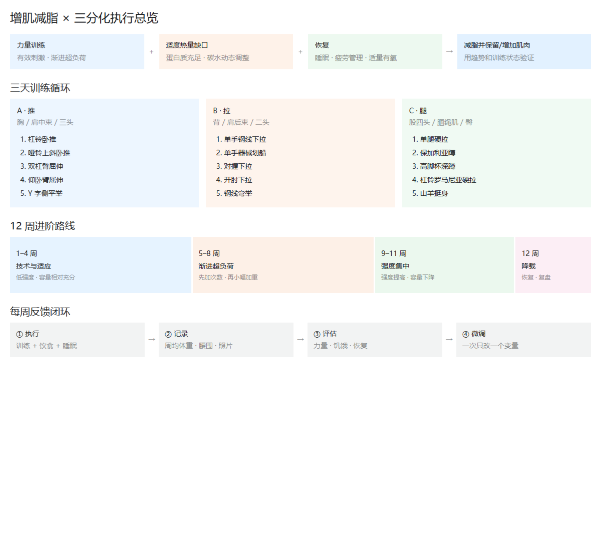

# Fitness

谭成义增肌减脂、饮食规划与三分化训练视频的结构化中文知识库。



## 内容导航

- [完整知识库](docs/fitness-knowledge-base.md)：增肌减脂原理、饮食结构与调整方法、三分化训练动作、训练术语、12 周进阶计划、有氧恢复和每周复盘。
- [可视化总览](assets/training-overview.html)：力量训练、饮食、恢复、三天训练循环及反馈闭环。

## 三分化结构

| 训练日 | 目标肌群 | 主要动作 |
|---|---|---|
| A：推 | 胸、三角肌中束、肱三头肌 | 杠铃卧推、哑铃上斜卧推、双杠臂屈伸、仰卧臂屈伸、Y 字侧平举 |
| B：拉 | 背、三角肌后束、肱二头肌 | 单手钢线下拉、单手器械划船、对握下拉、开肘下拉、钢线弯举 |
| C：腿 | 股四头肌、腘绳肌、臀部 | 单腿硬拉、保加利亚蹲、高脚杯深蹲、杠铃罗马尼亚硬拉、山羊挺身 |

## 在另一台电脑上使用

```bash
git clone https://github.com/miracle161218/Fitness.git
cd Fitness
code .
```

知识库内容来自相关公开视频的整理与整合，仅用于学习记录，不替代医学建议或面对面的专业训练指导。
